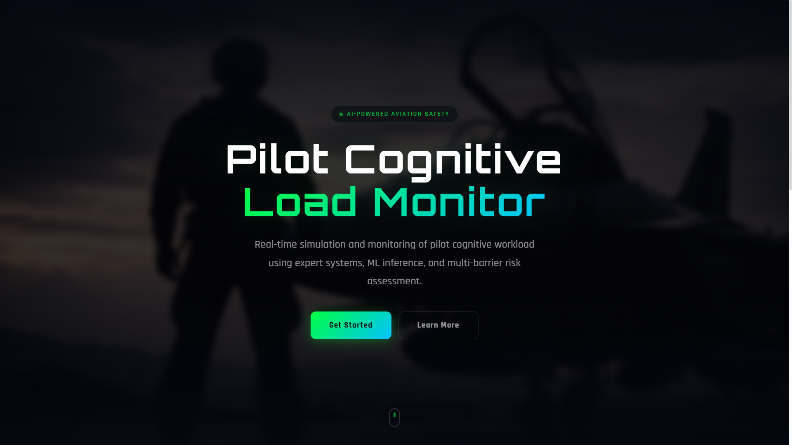
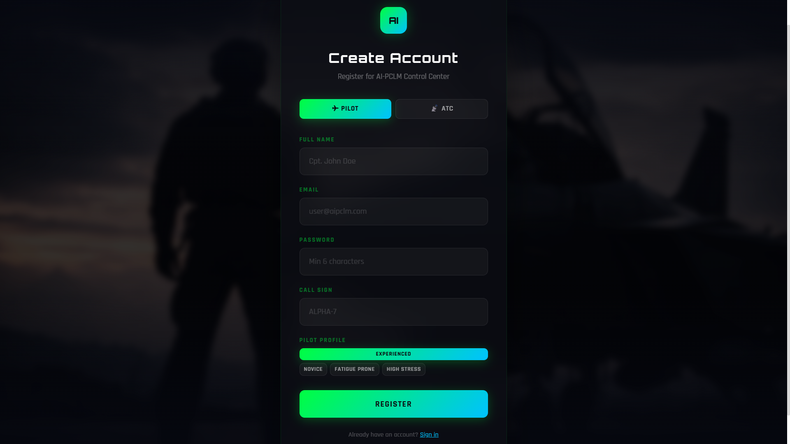
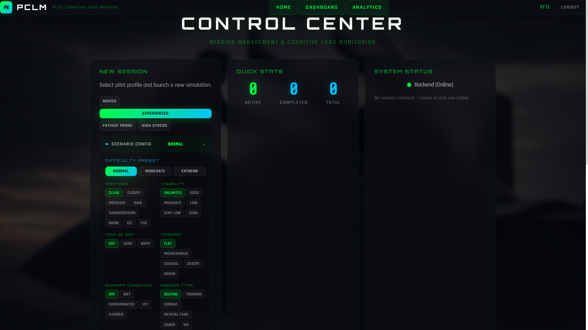
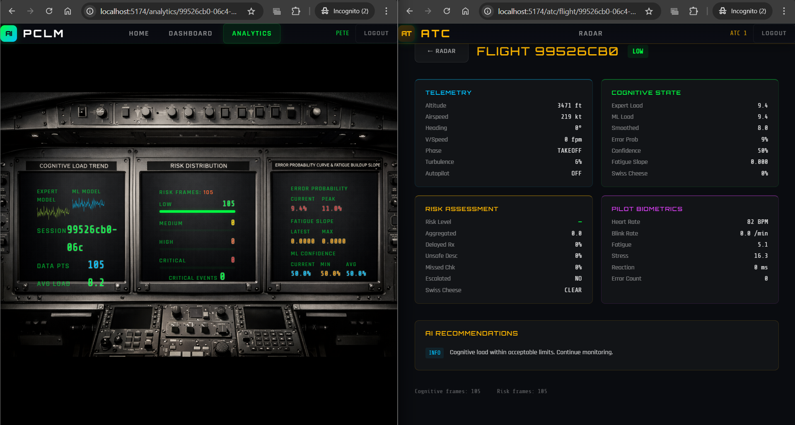
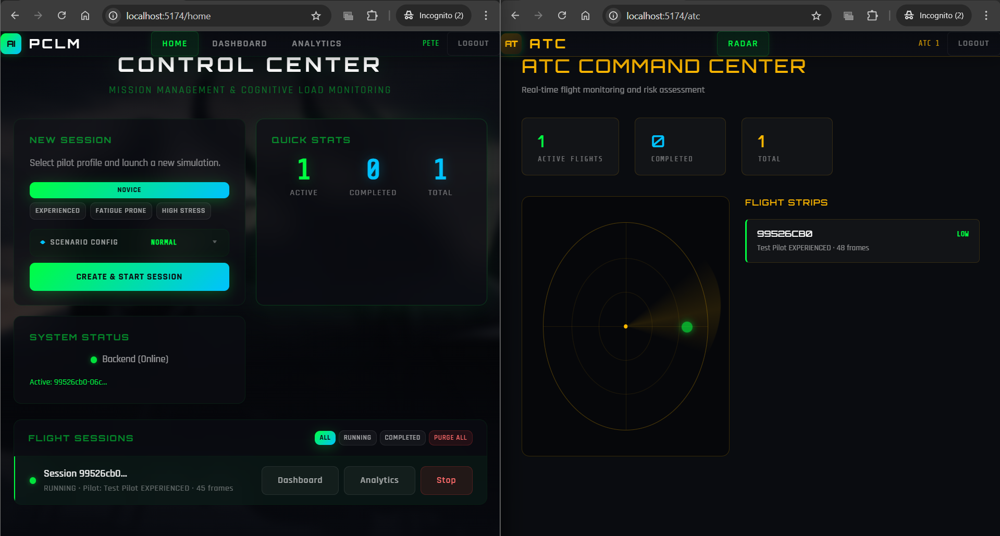
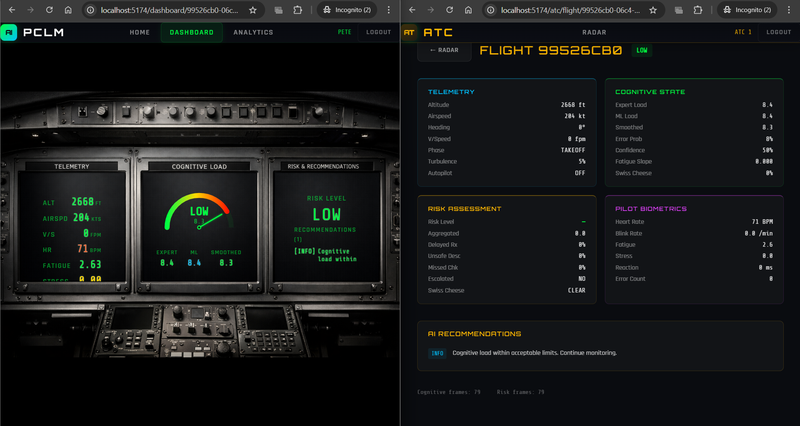

<p align="center">
  
</p>

<h1 align="center">AI-Pilot Cognitive Load Monitor System</h1>

<p align="center">
  <em>Full-stack real-time simulation and monitoring of pilot cognitive workload with a cockpit-grade React UI, JWT authentication, scenario-driven flight engine, expert + ML cognitive load fusion, Swiss Cheese risk model, AI-powered recommendations, multi-pilot Crew Resource Management (CRM) simulation, and wearable sensor integration for live biometric override.</em>
</p>

<p align="center">
  
  
  
  
  
  
  
  
</p>

<p align="center">
  
  
  
</p>

---

## Table of Contents

- [Overview](#-overview)
- [Screenshots](#-screenshots)
- [Key Features](#-key-features)
- [System Architecture](#-system-architecture)
- [Pipeline Flow](#-pipeline-flow)
- [Tech Stack](#-tech-stack)
- [Project Structure](#-project-structure)
- [Getting Started](#-getting-started)
- [API Endpoints](#-api-endpoints)
- [Testing](#-testing)
- [Bugs Fixed](#-bugs-fixed)
- [Development Roadmap](#-development-roadmap)

---

## 🧠 Overview

**AI-PCLM** (AI-Pilot Cognitive Load Monitor) is a full-stack simulation and monitoring platform designed to evaluate, predict, and mitigate pilot cognitive overload in real time. The system features:

- A **cockpit-themed React frontend** with real-time dashboards, animated radar displays, and scenario configuration
- **JWT-secured REST API** with role-based access (Pilot / ATC)
- **Configurable flight scenarios** (weather, emergency, terrain, visibility) with NORMAL / MODERATE / EXTREME presets
- **6-phase flight simulation** generating deterministic telemetry across TAKEOFF → CRUISE → LANDING
- **Expert + ML hybrid cognitive load** computation with confidence-weighted fusion, EMA smoothing, and fatigue trend analysis
- **Trained GradientBoosting model** (R²=0.981, MAE=2.13) with SHAP explainability and dynamic confidence scoring
- **Swiss Cheese multi-barrier risk assessment** with hysteresis-based escalation
- **AI-driven recommendations** including scenario-aware emergency procedures (SQUAWK 7700, DIVERT, DELAY TAKEOFF)

Built for **aviation safety researchers**, **human factors engineers**, and **cockpit design teams** who need a controlled environment to study cognitive load evolution during simulated flight missions.

> [!IMPORTANT]
> **Research & Simulation Platform** — AI-PCLM is a **proof-of-concept research system** built to demonstrate how real-time cognitive load monitoring, multi-barrier risk assessment, and AI-driven recommendations *could* work in an aviation context. The telemetry, biometrics, and cognitive load values are **simulated** using deterministic models, not sourced from live aircraft instruments or certified physiological sensors. This system is designed as a **foundation that can be integrated with real monitoring tools** — EEG headsets, eye trackers, certified avionics data buses (ARINC 429 / MIL-STD-1553), and wearable physiological sensors — to evolve into a production-grade cognitive load monitoring solution. In its current form, it serves as a research sandbox for studying cognitive workload patterns, validating risk assessment algorithms, and prototyping intervention strategies before deploying them in real cockpit environments.

---

## 📸 Screenshots

### Landing Page
*Hero section with system overview, feature highlights, and cockpit-themed UI built with Three.js animated backgrounds.*
<p align="center">
  
</p>

### Registration & Onboarding
*Role-based registration (Pilot / ATC) with pilot profile selection — choosing a cognitive profile affects simulation stress multipliers.*
<p align="center">
  
</p>

### Pilot Home — Session Management & Scenario Configuration
*Create new monitoring sessions with configurable flight scenarios (weather, emergency, terrain, visibility). Quick presets (NORMAL / MODERATE / EXTREME) or fully custom 9-axis configuration.*
<p align="center">
  
</p>

### Real-Time Flight Analytics
*Cognitive load sparkline trends, risk distribution breakdown, and ML performance metrics — updated every 3 seconds during active simulation.*
<p align="center">
  
</p>

### ATC Radar — Active Flight Detection
*Air Traffic Control command center with animated radar display showing risk-colored blips for each active flight, auto-refreshing every 3 seconds.*
<p align="center">
  
</p>

### ATC Flight Detail View
*Detailed flight monitoring for ATC operators — telemetry, cognitive state, risk assessment, pilot biometrics, and AI recommendations in a single view.*
<p align="center">
  
</p>

---

## ✨ Key Features

| Feature | Description |
|---------|-------------|
| 🔐 **JWT Authentication** | BCrypt password hashing, HMAC-SHA384 tokens (24h expiry), role-based routing (PILOT → cockpit, ATC → radar), auto-seeded demo accounts |
| 🎮 **Scenario Engine** | 9-axis flight scenario configuration (weather, emergency, terrain, visibility, runway, time-of-day, traffic, failures, fatigue) with 3 quick presets |
| 🛩️ **6-Phase Flight Simulation** | Deterministic telemetry generation with scenario-aware modifiers across TAKEOFF → CLIMB → CRUISE → DESCENT → APPROACH → LANDING |
| 🧮 **Expert + ML Hybrid Cognitive Load** | Weighted expert model (70%) blended with ML predictions (30%) using confidence-gated fusion |
| 🤖 **Trained ML Model** | GradientBoosting (500 trees, R²=0.981) with dynamic confidence, SHAP explainability, and hot-reload |
| 🧠 **SHAP Explainability** | TreeExplainer feature contributions for every prediction — visualized as cockpit SHAP driver bars |
| 📊 **EMA + Fatigue Trend** | Exponential Moving Average smoothing (α=0.3) and OLS fatigue slope over 10-frame window |
| 🔴 **4-Level Risk Classification** | LOW → MODERATE → HIGH → CRITICAL with hysteresis thresholds to prevent oscillation |
| 🧀 **Swiss Cheese Safety Model** | 4-barrier breach detection (fatigue, errors, turbulence, physiological stress) inspired by James Reason's model |
| 💡 **12 Recommendation Types** | 7 baseline + 5 scenario-aware (SQUAWK_7700, DELAY_TAKEOFF, DIVERT_TO_ALTERNATE, ENGAGE_AUTOPILOT, REDUCE_SPEED) |
| 📊 **Real-Time Cockpit Dashboard** | 3-panel layout with telemetry gauges, cognitive load radial gauge, risk & recommendations — WebSocket push |
| 📈 **Analytics Dashboard** | Sparkline trends, risk distribution bars, ML performance metrics — WebSocket streaming |
| 🗼 **ATC Radar View** | Animated radar with risk-colored blips, flight strip panel, WebSocket auto-refresh |
| 🔌 **WebSocket Real-Time Streaming** | STOMP over SockJS replacing HTTP polling — per-session topic channels with auto-reconnect, exponential back-off, and REST fallback for initial hydration |
| ⚛️ **Atomic Pipeline** | 5-stage @Transactional pipeline with full rollback on any stage failure |
| 🔄 **Confidence-Weighted Fusion** | `fused = conf × ML + (1−conf) × expert` — higher ML confidence → more weight to trained model |
| 📈 **Swiss Cheese Alignment** | 4-barrier breach tracking (load>70, fatigue>60, errors>2, turbulence>0.05) with real-time sparkline |
| 🛡️ **Duplicate Frame Guard** | Prevents duplicate telemetry frames on concurrent scheduler ticks |
| 👨‍✈️ **Multi-Pilot Crew Mode** | Captain + First Officer dual-crew simulation with independent biometrics, shared cockpit state, and PF/PM role differentiation |
| 🤝 **CRM Assessment Engine** | 7-metric Crew Resource Management evaluation per tick — communication, workload distribution, authority gradient, situational awareness, fatigue symmetry, cross-crew stress contagion, CRM effectiveness |
| 🔄 **Cross-Crew Fatigue Propagation** | Stress contagion (0.15 factor) and fatigue convergence (0.10 factor) between crew members |
| 📊 **Dual Cockpit Dashboard** | Side-by-side Captain/FO biometrics, dual cognitive load gauges, and real-time CRM HUD overlay |
| 📈 **CRM Analytics** | CRM effectiveness, communication, and fatigue symmetry sparklines with Captain vs FO load overlay |
| 🩺 **Wearable Sensor Integration** | Register, connect, and calibrate 6 physiological sensor types (HRM, EEG, Eye Tracker, GSR, Pulse Oximeter, Skin Temp) with live data ingestion |
| 📡 **Sensor Data Override** | Real-time biometric override — live sensor readings replace simulated values (HR, EEG bands, pupil diameter, GSR, SpO2, skin temperature) |
| 🔌 **Quick-Register Preset Devices** | One-click registration of 6 industry-standard devices (Garmin HRM-Pro+, Muse 2, Tobii Pro Nano, Shimmer3 GSR+, Masimo MightySat Rx, Empatica E4) |
| ◉ **LIVE SENSOR Dashboard** | Animated "LIVE SENSOR" badge and dedicated biometric rows (GSR, SpO2, Skin Temp, EEG α/β/θ, Pupil, Gaze) on cockpit dashboard |
| 🌦️ **Dynamic Weather Integration** | AVWX REST API for live METAR/TAF with 5-profile synthetic fallback (CLEAR/MARGINAL/IFR/STORMY/SEVERE). Weather severity scoring, wind shear, icing, ceiling, visibility injected into simulation |
| 📡 **ADS-B Traffic Surveillance** | OpenSky Network API for real-time aircraft tracking with synthetic traffic generator (3–11 aircraft). TCAS advisory detection, traffic density stress modifiers, haversine distance calculation |
| 🛫 **Weather-Aware Cockpit** | Dashboard weather/ADS-B rows (WX SEV, VIS, CEIL, SHEAR, ICING, TRAFFIC, CLOS AC, TCAS RA). Analytics sparklines for weather severity and nearby traffic trends. ICAO airport selector with ADS-B toggle |

---

## 🏗️ System Architecture

```
┌─────────────────────────────────────────────────────────────────────────────┐
│                            AI-PCLM SYSTEM                                   │
│                                                                             │
│  ┌─────────────────────────────────────────────────────────────────────┐    │
│  │                     REACT FRONTEND (:5174)                          │    │
│  │  Landing → Login/Register → Home → Dashboard → Analytics            │    │
│  │  ATC Radar → ATC Flight Detail                                      │    │
│  │  ScenarioConfigurator · RadialGauge · Sparkline · ThreeBackground   │    │
│  └──────────────────────────────┬──────────────────────────────────────┘    │
│                                 │ REST + JWT + STOMP/SockJS WebSocket       │
│  ┌──────────────────────────────▼──────────────────────────────────────┐    │
│  │                   SPRING BOOT BACKEND (:8080)                       │    │
│  │                                                                     │    │
│  │  ┌──────────┐  ┌──────────┐  ┌───────────────┐  ┌──────────────┐  │    │
│  │  │   Auth   │  │ Scenario │  │  Scheduler    │  │  Session     │  │    │
│  │  │  JWT +   │  │  Engine  │  │  (1Hz tick)   │  │  Controller  │  │    │
│  │  │  BCrypt  │  │  9-axis  │  │  + WS Push    │  │  + WS Bcast  │  │    │
│  │  └──────────┘  └──────────┘  └──────┬────────┘  └──────────────┘  │    │
│  │                                      │                              │    │
│  │  ┌──────────────────────────────────────────────────────────────┐   │    │
│  │  │         SENSOR INTEGRATION (Phase 5)                         │   │    │
│  │  │  SensorIngestionService · SensorIngestionController           │   │    │
│  │  │  SensorDevice + SensorReading entities                       │   │    │
│  │  │  6 sensor types · Auto-calibration · Biometric override      │   │    │
│  │  └──────────────────────────────────────────────────────────────┘   │    │
│  │                                      │                              │    │
│  │                              ┌──────▼────────┐                     │    │
│  │                              │  Orchestrator  │ (Atomic Tx)        │    │
│  │                              └──────┬────────┘                     │    │
│  │                    ┌────────────────┼────────────────┐             │    │
│  │              ┌─────▼─────┐  ┌──────▼──────┐  ┌─────▼──────┐      │    │
│  │              │ Simulation│  │  Cognitive   │  │   Risk     │      │    │
│  │              │  Engine   │  │  Load Svc    │  │  Engine    │      │    │
│  │              │ +Scenario │  │ Expert+ML    │  │ SwissCheese│      │    │
│  │              │ +CrewMode │  │ (×2 in crew) │  │            │      │    │
│  │              └───────────┘  └──────┬──────┘  └────────────┘      │    │
│  │                                    │                              │    │
│  │                  ┌─────────────────┼─────────────────┐            │    │
│  │                  │                 │                  │            │    │
│  │           ┌──────▼──────┐  ┌──────▼─────────┐  ┌────▼───────┐   │    │
│  │           │     CRM     │  │ Recommendation  │  │  Crew      │   │    │
│  │           │  Assessment │  │ Engine (12 rules)│  │ Assignment │   │    │
│  │           │  (7 metrics)│  └────────────────┘  │  Repository │   │    │
│  │           └─────────────┘                      └────────────┘   │    │
│  └──────────────────────────────────┬────────────────────────────────┘    │
│                                     │                                     │
│  ┌──────────────────┐    ┌──────────▼──────────┐                          │
│  │  ML Inference Svc │    │    PostgreSQL 18    │                          │
│  │  (FastAPI :8001)  │    │    (aipclm_db)      │                          │
│  │  GradientBoosting │    └─────────────────────┘                          │
│  │  SHAP Explainer   │                                                     │
│  │  /predict /explain│                                                     │
│  │  /model/info      │                                                     │
│  └──────────────────┘                                                     │
└─────────────────────────────────────────────────────────────────────────────┘
```

---

## 🔄 Pipeline Flow

Each simulation tick executes this **5-stage atomic pipeline**:

```
Stage 1 ─ Telemetry Generation
   │  SimulationEngineService generates a TelemetryFrame with
   │  scenario-aware modifiers (weather, emergency, visibility multipliers)
   │  Crew Mode: generates two frames (Captain + FO) with shared cockpit
   │  state and PF/PM role differentiation
   │  Sensor Mode: applySensorOverrides() replaces simulated biometrics
   │  with live sensor readings (HR, EEG, Eye, GSR, SpO2, Skin Temp)
   ▼
Stage 2 ─ Cognitive Load Computation
   │  CognitiveLoadService computes expert load (weighted sum of 12 factors),
   │  calls trained GradientBoosting model for ML prediction, fuses them via
   │  confidence-weighted blending, applies EMA smoothing (α=0.3), computes
   │  fatigue trend slope (OLS on 10-frame window), and Swiss Cheese alignment
   │  Crew Mode: runs independently for Captain and FO
   ▼
Stage 2.5 ─ CRM Assessment (Crew Mode Only)
   │  CrmService evaluates 7 CRM metrics: communication, workload distribution,
   │  authority gradient, situational awareness, fatigue symmetry, cross-crew
   │  stress contagion, and composite CRM effectiveness score
   │  Cross-crew propagation: stress contagion (0.15) + fatigue convergence (0.10)
   ▼
Stage 3 ─ Risk Assessment
   │  RiskEngineService classifies risk (LOW/MODERATE/HIGH/CRITICAL)
   │  using EMA-smoothed load, hysteresis bands, Swiss Cheese barriers,
   │  scenario severity floor, and confidence gate
   │  Crew Mode: assesses worst-case load across both crew members
   ▼
Stage 4 ─ Recommendation Generation
   │  RecommendationEngineService applies 12 rule-based triggers including
   │  scenario-aware rules (emergency → SQUAWK_7700, visibility → DELAY_TAKEOFF)
   ▼
Stage 5 ─ Persist & Commit
      All entities saved atomically; any failure rolls back all stages
```

### Hysteresis Thresholds

| Transition | Escalation (↑) | De-escalation (↓) |
|------------|:--------------:|:------------------:|
| LOW → MODERATE | 40 | 35 |
| MODERATE → HIGH | 60 | 55 |
| HIGH → CRITICAL | 80 | 75 |

### Swiss Cheese Barriers

| Barrier | Trigger Condition |
|---------|-------------------|
| 🔋 Fatigue | `fatigueIndex > 70` |
| ❌ Errors | `errorCount >= 3` |
| 🌪️ Turbulence | `turbulenceLevel > 0.7` |
| 💓 Physiological | `heartRate > 120 AND stressIndex > 60` |

> **Rule**: All 4 barriers must be breached simultaneously + `smoothedLoad > 70` to trigger Swiss Cheese CRITICAL escalation.

### Sensor Override Pipeline (Sensor Mode)

When a session runs in **sensor mode**, `applySensorOverrides()` replaces simulated biometrics with live sensor readings:

| Sensor Type | Override Target | Normalization Range | Unit |
|-------------|----------------|:-------------------:|------|
| 🫀 Heart Rate Monitor | `heartRate` | 30 – 240 | BPM |
| 🧠 EEG Headband | `eegAlpha/Beta/ThetaPower` | 0 – 100 | µV² |
| 👁️ Eye Tracker | `pupilDiameter`, `gazeFixation`, `blinkRate` | 0 – 20 | mm |
| ⚡ GSR Sensor | `gsrLevel` | 0 – 40 | µS |
| 🩸 Pulse Oximeter | `spO2Level` | 70 – 100 | % |
| 🌡️ Skin Temperature | `skinTemperature` | 30 – 42 | °C |

> **Preset Devices**: Garmin HRM-Pro+, Muse 2, Tobii Pro Nano, Shimmer3 GSR+, Masimo MightySat Rx, Empatica E4

### CRM Assessment Metrics (Crew Mode)

| Metric | Formula / Source | Weight in CRM Effectiveness |
|--------|-----------------|:---------------------------:|
| 📡 Communication | Based on workload balance & stress levels | 25% |
| ⚖️ Workload Distribution | \|captainLoad − foLoad\| deviation | 20% |
| 🎖️ Authority Gradient | Profile experience ratio (NOVICE=1, EXPERIENCED=4) | — |
| 🧭 Situational Awareness | Average of both crew SA scores | 25% |
| 🔋 Fatigue Symmetry | 1 − \|captainFatigue − foFatigue\| / 100 | 15% |
| 🔴 Stress Contagion | Cross-crew propagation (factor = 0.15) | 15% |
| 📊 CRM Effectiveness | Weighted composite of all above | 100% |

### Scenario Modifiers

| Factor | Options | Effect |
|--------|---------|--------|
| Weather | CLEAR · RAIN · SNOW · FOG · THUNDERSTORM · ICE | Turbulence & stress multiplier |
| Emergency | NONE · ENGINE_FAILURE · FIRE · HYDRAULIC_FAILURE · BIRD_STRIKE · MEDICAL | Risk floor + emergency recommendations |
| Terrain | FLAT · MOUNTAINOUS · COASTAL · URBAN · DESERT · OCEANIC | Workload modifier |
| Visibility | UNLIMITED → ZERO (6 levels) | Low-visibility triggers DELAY_TAKEOFF |
| Time of Day | DAY · NIGHT · DAWN · DUSK | Fatigue modifier |
| Runway | DRY · WET · ICY · CONTAMINATED · FLOODED | Landing risk |
| Traffic Density | 0–10 | ATC workload |
| System Failures | 0–5 | Cascading stress |
| Crew Fatigue | 0–10 | Pre-existing fatigue |

---

## 🛠️ Tech Stack

### Backend

| Technology | Purpose |
|-----------|---------|
|  | Core language |
|  | Application framework |
|  | ORM & repository layer |
|  | JWT authentication & authorization |
|  | Non-blocking ML service calls |
|  | STOMP over SockJS real-time push |
|  | Production database |
|  | In-memory test database |
|  | JWT token generation & validation |
|  | Boilerplate reduction |
|  | Build tool |

### Frontend

| Technology | Purpose |
|-----------|---------|
|  | UI framework |
|  | Build tool & dev server |
|  | Utility-first styling |
|  | 3D animated background |
|  | Client-side routing |
|  | HTTP client with JWT interceptor |
|  | STOMP WebSocket client |
|  | WebSocket fallback transport |

### ML Service

| Technology | Purpose |
|-----------|---------|
|  | ML service language |
|  | REST API framework |
|  | GradientBoosting model training & inference |
|  | TreeExplainer feature attribution |
|  | Numerical operations |
|  | Dataset handling & feature engineering |
|  | Model serialization & versioning |
|  | Request validation |
|  | ASGI server |

### Testing

| Technology | Purpose |
|-----------|---------|
|  | Testing framework |
|  | Mocking framework |
|  | Fluent assertions |

---

## 📁 Project Structure

```
ai-pclm/
├── README.md
│
├── aipclm-backend/                              # Spring Boot Backend
│   ├── pom.xml
│   └── src/
│       ├── main/java/com/aipclm/system/
│       │   ├── AipclmBackendApplication.java
│       │   ├── auth/                            # ── Phase 0: Auth Foundation ──
│       │   │   ├── controller/
│       │   │   │   └── AuthController.java          # /api/auth/** endpoints
│       │   │   ├── dto/
│       │   │   │   ├── AuthResponse.java
│       │   │   │   ├── LoginRequest.java
│       │   │   │   └── RegisterRequest.java
│       │   │   ├── model/
│       │   │   │   ├── User.java                    # User entity (email, password, role)
│       │   │   │   └── UserRole.java                # PILOT | ATC
│       │   │   ├── repository/
│       │   │   │   └── UserRepository.java
│       │   │   ├── security/
│       │   │   │   ├── JwtAuthFilter.java           # OncePerRequestFilter
│       │   │   │   └── JwtTokenProvider.java        # HMAC-SHA384 token utils
│       │   │   └── service/
│       │   │       └── AuthService.java             # Register, login, BCrypt
│       │   ├── cognitive/
│       │   │   ├── model/
│       │   │   │   ├── CognitiveState.java
│       │   │   │   └── RiskLevel.java               # LOW | MODERATE | HIGH | CRITICAL
│       │   │   ├── repository/
│       │   │   │   └── CognitiveStateRepository.java
│       │   │   └── service/
│       │   │       ├── CognitiveLoadService.java    # Expert + ML fusion + EMA + Swiss Cheese
│       │   │       ├── MLInferenceService.java      # WebClient ML caller + SHAP explainability
│       │   │       ├── MLExplainResponse.java       # SHAP feature contribution DTO
│       │   │       ├── MLPredictionRequest.java
│       │   │       └── MLPredictionResponse.java
│       │   ├── config/
│       │   │   ├── CorsConfig.java
│       │   │   ├── DataSeeder.java                  # Seed pilot@aipclm.com & tower@aipclm.com
│       │   │   ├── SecurityConfig.java              # Spring Security filter chain
│       │   │   └── WebSocketConfig.java             # STOMP/SockJS WebSocket config
│       │   ├── pilot/
│       │   │   ├── model/
│       │   │   │   ├── Pilot.java
│       │   │   │   └── PilotProfileType.java        # EXPERIENCED | NOVICE | FATIGUE_PRONE | HIGH_STRESS
│       │   │   └── repository/
│       │   │       └── PilotRepository.java
│       │   ├── recommendation/
│       │   │   ├── model/
│       │   │   │   ├── AIRecommendation.java
│       │   │   │   ├── RecommendationType.java      # 12 recommendation types
│       │   │   │   └── Severity.java                # INFO | CAUTION | WARNING | CRITICAL
│       │   │   ├── repository/
│       │   │   │   └── AIRecommendationRepository.java
│       │   │   └── service/
│       │   │       └── RecommendationEngineService.java
│       │   ├── risk/
│       │   │   ├── model/
│       │   │   │   └── RiskAssessment.java
│       │   │   ├── repository/
│       │   │   │   └── RiskAssessmentRepository.java
│       │   │   └── service/
│       │   │       └── RiskEngineService.java       # Hysteresis + Swiss Cheese + scenario floor
│       │   ├── scenario/                            # ── Phase 1: Scenario Engine ──
│       │   │   ├── controller/
│       │   │   │   └── ScenarioController.java      # /api/scenario/** CRUD
│       │   │   ├── dto/
│       │   │   │   └── ScenarioRequest.java
│       │   │   ├── model/
│       │   │   │   ├── DifficultyPreset.java        # NORMAL | MODERATE | EXTREME
│       │   │   │   ├── EmergencyType.java
│       │   │   │   ├── FlightScenario.java          # 9-axis scenario entity
│       │   │   │   ├── MissionType.java
│       │   │   │   ├── RunwayCondition.java
│       │   │   │   ├── TerrainType.java
│       │   │   │   ├── TimeOfDay.java
│       │   │   │   ├── VisibilityLevel.java
│       │   │   │   └── WeatherCondition.java
│       │   │   ├── repository/
│       │   │   │   └── FlightScenarioRepository.java
│       │   │   └── service/
│       │   │       └── ScenarioService.java
│       │   ├── session/
│       │   │   ├── controller/
│       │   │   │   └── SessionMonitoringController.java  # /api/session/** REST API
│       │   │   ├── model/
│       │   │   │   ├── FlightSession.java
│       │   │   │   └── FlightSessionStatus.java
│       │   │   ├── repository/
│       │   │   │   └── FlightSessionRepository.java
│       │   │   └── service/
│       │   │       └── WebSocketBroadcastService.java    # Phase 2: STOMP broadcast
│       │   ├── simulation/
│       │   │   ├── service/
│       │   │   │   ├── SimulationEngineService.java     # Scenario-aware telemetry gen
│       │   │   │   ├── SimulationOrchestratorService.java
│       │   │   │   └── SimulationSchedulerService.java  # 1Hz scheduler
│       │   │   └── web/
│       │   │       └── SessionTestController.java
│       │   ├── crm/                                 # ── Phase 4: Crew Resource Management ──
│       │   │   ├── model/
│       │   │   │   ├── CrewAssignment.java               # Pilot ↔ Session ↔ CrewRole link
│       │   │   │   └── CrmAssessment.java                # Per-tick 7-metric CRM entity
│       │   │   ├── repository/
│       │   │   │   ├── CrewAssignmentRepository.java
│       │   │   │   └── CrmAssessmentRepository.java
│       │   │   └── service/
│       │   │       └── CrmService.java                   # Cross-crew propagation + CRM scoring
│       │   └── telemetry/
│       │       ├── model/
│       │       │   ├── PhaseOfFlight.java
│       │       │   └── TelemetryFrame.java          # 40+ sensor fields (incl. sensor biometrics)
│       │       └── repository/
│       │           └── TelemetryFrameRepository.java
│       │
│       ├── main/resources/
│       │   └── application.yml
│       │
│       └── test/java/com/aipclm/system/             # 115 unit tests
│
├── aipclm-frontend/                                 # React Frontend
│   ├── package.json
│   ├── vite.config.js
│   ├── tailwind.config.js
│   └── src/
│       ├── App.jsx
│       ├── main.jsx
│       ├── index.css                                # Cockpit theme (Orbitron/Rajdhani/Share Tech Mono)
│       ├── components/
│       │   ├── GlassPanel.jsx                       # Frosted glass card component
│       │   ├── MiniChart.jsx                        # Inline trend charts
│       │   ├── RadialGauge.jsx                      # Cognitive load circular gauge
│       │   ├── RecommendationCard.jsx               # Severity-tagged AI recommendation
│       │   ├── RiskIndicator.jsx                    # Risk level badge
│       │   ├── ScenarioConfigurator.jsx             # 9-axis scenario config accordion
│       │   ├── Sparkline.jsx                        # Animated sparkline charts
│       │   ├── TechGrid.jsx                         # Background grid pattern
│       │   └── ThreeBackground.jsx                  # Three.js animated cockpit background
│       ├── context/
│       │   ├── AuthContext.jsx                      # JWT auth state management
│       │   └── SessionContext.jsx                   # Active session state
│       ├── layouts/
│       │   ├── AtcLayout.jsx                        # ATC navigation layout
│       │   ├── ProtectedLayout.jsx                  # Pilot navigation layout
│       │   └── PublicLayout.jsx                     # Public page layout
│       ├── pages/
│       │   ├── LandingPage.jsx                      # / — Hero + feature cards
│       │   ├── LoginPage.jsx                        # /login
│       │   ├── RegisterPage.jsx                     # /register
│       │   ├── HomePage.jsx                         # /home — Session creation + list
│       │   ├── DashboardPage.jsx                    # /dashboard/:id — Real-time cockpit
│       │   ├── AnalyticsPage.jsx                    # /analytics/:id — Trends & ML perf
│       │   ├── AtcRadarPage.jsx                     # /atc — Animated radar display
│       │   └── AtcFlightDetailPage.jsx              # /atc/flight/:id — Flight detail
│       ├── router/
│       │   └── AppRouter.jsx                        # Route config with guards
│       ├── hooks/
│       │   └── useWebSocket.js                      # Phase 2: WebSocket subscription hook
│       └── services/
│           ├── api.js                               # Axios client + JWT interceptor
│           └── websocket.js                         # Phase 2: STOMP/SockJS client
│
└── aipclm-ml-service/                               # Python ML Microservice
    ├── main.py                                      # FastAPI with /predict, /explain, /model/info
    ├── requirements.txt
    ├── models/                                      # Phase 3: Trained model artifacts
    │   ├── cognitive_load_model_v1.0.0.joblib       # GBM model (500 trees, R²=0.981)
    │   ├── cognitive_load_model_latest.joblib        # Latest version symlink
    │   └── model_metadata.json                      # Training metrics & feature list
    └── training/                                    # Phase 3: Model training pipeline
        ├── generate_dataset.py                      # 50K synthetic sample generator
        ├── train_model.py                           # GradientBoosting dual-model trainer
        └── data/
            └── cognitive_load_dataset.csv           # Generated training dataset
```

---

## 🚀 Getting Started

### Prerequisites

| Requirement | Version |
|------------|---------|
| Java JDK | 17+ |
| Maven | 3.8+ |
| Node.js | 18+ |
| Python | 3.11+ |
| PostgreSQL | 15+ |
| Git | 2.30+ |

### 1. Clone the Repository

```bash
git clone https://github.com/ayush-mishra7/ai-pilot-cognitive-load-monitor-system.git
cd ai-pilot-cognitive-load-monitor-system
```

### 2. Set Up the Database

```sql
CREATE DATABASE aipclm_db;
```

> Default credentials: `postgres:postgres` on `localhost:5432`. Update `aipclm-backend/src/main/resources/application.yml` if different.

### 3. Start the ML Service (Optional)

```bash
cd aipclm-ml-service
pip install -r requirements.txt
python main.py
# → http://localhost:8001 (auto-fallback if unavailable)
```

### 4. Start the Backend

```bash
cd aipclm-backend
mvn spring-boot:run
# → http://localhost:8080
```

Verify: `curl http://localhost:8080/api/auth/health` → `{"status":"UP"}`

### 5. Start the Frontend

```bash
cd aipclm-frontend
npm install
npx vite --port 5174
# → http://localhost:5174
```

### 6. Login & Start Monitoring

Open `http://localhost:5174` in your browser. Use the pre-seeded demo accounts:

| Role | Email | Password | Call Sign |
|------|-------|----------|-----------|
| **PILOT** | `pilot@aipclm.com` | `pilot123` | ALPHA-7 |
| **ATC** | `tower@aipclm.com` | `tower123` | TOWER-1 |

### 🐳 Docker — Single-Command Startup (Alternative)

Skip steps 2–5 above and run the entire stack with one command:

```bash
docker compose up --build
```

| Service | URL |
|---------|-----|
| Frontend | http://localhost |
| Backend API | http://localhost:8080 |
| ML Service | http://localhost:8001 |
| PostgreSQL | localhost:5432 |

> Docker Compose provisions PostgreSQL automatically — no manual DB setup needed.  
> To reset data: `docker compose down -v && docker compose up --build`

### ☸️ Kubernetes Deployment

**Raw manifests (for dev/testing):**

```bash
kubectl apply -f k8s/namespace.yaml
kubectl apply -f k8s/
```

**Helm chart (for production):**

```bash
helm install aipclm ./helm/aipclm
# Override values:
helm install aipclm ./helm/aipclm \
  --set backend.jwtSecret=<production-secret> \
  --set postgres.credentials.password=<strong-password> \
  --set ingress.host=aipclm.yourdomain.com
```

The Helm chart includes a **Horizontal Pod Autoscaler** for the ML service (2–8 replicas, CPU 70% target).

### 📊 Observability Stack (Prometheus + Grafana + Jaeger)

Launch the full stack with monitoring, dashboards, and distributed tracing:

```bash
docker compose -f docker-compose.yml -f docker-compose.observability.yml up --build
```

| Service | URL | Credentials |
|---------|-----|-------------|
| Prometheus | http://localhost:9090 | — |
| Grafana | http://localhost:3000 | admin / admin |
| Jaeger UI | http://localhost:16686 | — |

> Grafana auto-provisions the **AI-PCLM** dashboard with 10 panels: pipeline throughput, latency P50/P95/P99, ML inference timing, fallback rate, HTTP status breakdown, JVM heap, and HikariCP connection pool.

---

## 📡 API Endpoints

### Authentication (`/api/auth`)

| Method | Endpoint | Description |
|--------|----------|-------------|
| `POST` | `/api/auth/register` | Register new user (PILOT or ATC) |
| `POST` | `/api/auth/login` | Login → returns JWT token |
| `GET` | `/api/auth/me` | Get current user info |
| `GET` | `/api/auth/health` | Health check |

### Sessions (`/api/session`) — *Requires JWT*

| Method | Endpoint | Description |
|--------|----------|-------------|
| `POST` | `/api/session` | Create new flight session |
| `GET` | `/api/session/list` | List all sessions |
| `GET` | `/api/session/{id}` | Get session by ID |
| `DELETE` | `/api/session/{id}` | Delete session + all child data |
| `DELETE` | `/api/session/purge-all` | Purge all sessions |
| `GET` | `/api/session/{id}/latest-state` | Latest telemetry + cognitive + risk + recommendations |
| `GET` | `/api/session/{id}/cognitive/latest` | Latest cognitive assessment |
| `GET` | `/api/session/{id}/risk/latest` | Latest risk assessment |
| `GET` | `/api/session/{id}/cognitive/history` | All cognitive frames |
| `GET` | `/api/session/{id}/risk/history` | All risk frames |
| `GET` | `/api/session/{id}/recommendations/latest` | Latest recommendations |
| `GET` | `/api/session/{id}/explainability` | SHAP feature contributions for latest frame |

### Scenarios (`/api/scenario`) — *Requires JWT*

| Method | Endpoint | Description |
|--------|----------|-------------|
| `POST` | `/api/scenario/{sessionId}` | Create scenario for session |
| `GET` | `/api/scenario/{sessionId}` | Get scenario for session |
| `PUT` | `/api/scenario/{sessionId}` | Update scenario (mid-flight OK) |

### Simulation (`/api/simulation`) — *Requires JWT*

| Method | Endpoint | Description |
|--------|----------|-------------|
| `POST` | `/api/simulation/{sessionId}/start` | Start simulation engine |
| `POST` | `/api/simulation/{sessionId}/stop` | Stop simulation engine |

### Crew / CRM (`/api/test/simulation` + `/api/session`) — *Requires JWT*

| Method | Endpoint | Description |
|--------|----------|-------------|
| `POST` | `/api/test/simulation/start-crew?captainProfile=X&foProfile=Y` | Start crew-mode session (Captain + FO) |
| `POST` | `/api/test/simulation/start-sensor?profile=X` | Start sensor-mode session |
| `GET` | `/api/session/{id}/crm-history` | Get all CRM assessment frames for session |

### Sensor Integration (`/api/sensor`)

| Method | Endpoint | Description |
|--------|----------|-------------|
| `POST` | `/api/sensor/device` | Register a new sensor device |
| `GET` | `/api/sensor/device/list` | List all sensor devices |
| `GET` | `/api/sensor/device/{id}` | Get sensor device by ID |
| `PUT` | `/api/sensor/device/{id}/connect/{sessionId}` | Connect device to a session (auto-calibrate) |
| `PUT` | `/api/sensor/device/{id}/disconnect` | Disconnect device from session |
| `PUT` | `/api/sensor/device/{id}/calibrate` | Re-calibrate device |
| `POST` | `/api/sensor/reading` | Ingest a single sensor reading |
| `POST` | `/api/sensor/reading/batch` | Ingest batch of sensor readings |
| `GET` | `/api/sensor/session/{id}/status` | Get sensor status for a session |
| `GET` | `/api/sensor/session/{id}/latest-values` | Get latest normalized values per sensor type |
| `GET` | `/api/sensor/session/{id}/readings` | Get all readings for a session |
| `POST` | `/api/sensor/quick-register` | One-click register all 6 preset devices |

### Weather Endpoints

| Method | Endpoint | Description |
|--------|----------|-------------|
| `POST` | `/api/weather/metar/{icao}` | Fetch fresh METAR for an ICAO airport (live API or synthetic) |
| `POST` | `/api/weather/taf/{icao}` | Fetch fresh TAF for an ICAO airport |
| `GET` | `/api/weather/metar/{icao}` | Get latest cached METAR observation |
| `GET` | `/api/weather/history/{icao}` | Get METAR history (up to 20 observations) |

### ADS-B Endpoints

| Method | Endpoint | Description |
|--------|----------|-------------|
| `POST` | `/api/adsb/fetch?lat=&lon=` | Fetch nearby aircraft from OpenSky Network (or synthetic) |
| `GET` | `/api/adsb/nearby?lat=&lon=` | Get cached nearby aircraft |
| `GET` | `/api/adsb/summary?lat=&lon=` | Get traffic summary (count, closest distance, within 5nm) |

### ML Inference Service (`:8001`)

| Method | Endpoint | Description |
|--------|----------|-------------|
| `GET` | `/health` | Health check |
| `POST` | `/predict` | Predict cognitive load from telemetry features (trained GBM model) |
| `POST` | `/explain` | SHAP feature contributions for a prediction |
| `GET` | `/model/info` | Model metadata (version, features, metrics) |
| `POST` | `/model/reload` | Hot-reload latest model from disk |

### WebSocket Topics (STOMP over SockJS)

| Topic | Payload | Mode |
|-------|---------|------|
| `/topic/session/{id}/state` | Telemetry + cognitive + risk + recommendations (+ crew data in crew mode) | Single + Crew |
| `/topic/session/{id}/cognitive-history` | Cognitive state history array | Single + Crew |
| `/topic/session/{id}/risk-history` | Risk assessment history array | Single + Crew |
| `/topic/session/{id}/crm-history` | CRM assessment history array | Crew only |
| `/topic/session/{id}/sensor-status` | Sensor device connection status | Sensor only |
| `/topic/sessions` | Active session list | Global |

---

## 🧪 Testing

### Run All Tests

```bash
cd aipclm-backend
mvn test
```

### Test Results

```
Tests run: 115, Failures: 0, Errors: 0, Skipped: 0 — BUILD SUCCESS
```

### Test Suite Breakdown

| # | Test Class | Tests | Category | Description |
|---|-----------|:-----:|----------|-------------|
| 1 | `SimulationEngineServiceTest` | **23** | 🛩️ Simulation | Phase transitions, noise determinism, scenario modifiers |
| 2 | `RiskEngineServiceTest` | **20** | 🔴 Risk | Hysteresis, Swiss Cheese, confidence gate |
| 3 | `SystemMustNotDoTest` | **14** | 🚫 Constraints | 14 negative safety invariants |
| 4 | `RecommendationEngineServiceTest` | **13** | 💡 Recommendation | All 12 rule triggers, deduplication |
| 5 | `CognitiveLoadServiceTest` | **10** | 🧮 Cognitive | Expert weights, ML fusion, clamping |
| 6 | `SimulationOrchestratorServiceTest` | **9** | ⚛️ Orchestration | Atomic integrity, rollback |
| 7 | `MLInferenceServiceTest` | **8** | 🤖 ML Inference | Timeout, fallback modes |
| 8 | `SessionMonitoringControllerTest` | **8** | 📊 Controller | DTO-only exposure, 404 handling |
| 9 | `SimulationSchedulerServiceTest` | **8** | 🔄 Scheduler | Lifecycle, concurrency guards |
| 10 | `PilotRepositoryTest` | **1** | 🗄️ Repository | JPA integration |
| 11 | `TelemetryFrameRepositoryTest` | **1** | 🗄️ Repository | JPA integration |

---

## 🐛 Bugs Fixed

| # | Bug | Fix |
|---|-----|-----|
| 1 | **ML service crash** — No error handling when ML unreachable | Added try/catch with fallback (confidence=0.5) + 3s timeout |
| 2 | **smoothedLoad always 0.0** — EMA never persisted | Added `cogState.setSmoothedLoad()` + save |
| 3 | **Duplicate telemetry frames** — Concurrent scheduler race | Added frame number guard before generation |
| 4 | **DELETE 403 Forbidden** — SecurityAutoConfiguration exclusion conflicting with custom SecurityConfig | Removed exclusion from `@SpringBootApplication` |
| 5 | **Session delete FK violation** — flight_scenario not cleaned up | Added scenario delete to session delete + purge-all |

---

## 🗺️ Development Roadmap

### Completed Phases

| Phase | Name | Status | Description |
|:-----:|------|:------:|-------------|
| **0** | **Auth Foundation** | ✅ Done | JWT authentication, BCrypt, role-based access (PILOT/ATC), auto-seeded accounts, Spring Security config, React login/register |
| **1** | **Scenario Engine** | ✅ Done | 9-axis flight scenario configuration, 3 presets (NORMAL/MODERATE/EXTREME), scenario-aware simulation modifiers, 5 new recommendation types, cockpit dashboard, analytics, ATC radar |
| **3** | **Advanced ML Pipeline** | ✅ Done | Trained GradientBoosting model (R²=0.981, MAE=2.13) on 50K synthetic dataset. Confidence-weighted expert–ML fusion, EMA smoothing (α=0.3), fatigue trend slope (OLS on 10-frame window), Swiss Cheese 4-barrier alignment score. SHAP TreeExplainer with `/explain` endpoint. Dynamic confidence via uncertainty model. Cockpit SHAP driver bars and Swiss Cheese sparkline on Analytics page. |
| **4** | **Multi-Pilot & CRM Simulation** | ✅ Done | Captain + First Officer dual-crew cockpit with shared cockpit state and PF/PM role differentiation. 7-metric CRM assessment engine (communication, workload distribution, authority gradient, situational awareness, fatigue symmetry, cross-crew stress contagion, CRM effectiveness). Cross-crew fatigue propagation (stress contagion 0.15, fatigue convergence 0.10). Dual-crew dashboard with side-by-side biometrics, dual cognitive load gauges, and real-time CRM HUD. CRM analytics sparklines on Analytics page. CrewAssignment + CrmAssessment entities, crew-aware WebSocket broadcast. |
| **5** | **Wearable & Sensor Integration** | ✅ Done | 6-type sensor device registry (HRM, EEG, Eye Tracker, GSR, Pulse Oximeter, Skin Temp) with auto-calibration and connection lifecycle. SensorDevice + SensorReading entities with normalized ingestion. Live biometric override — `applySensorOverrides()` replaces simulated telemetry (HR, EEG α/β/θ bands, pupil diameter, gaze fixation, blink rate, GSR, SpO₂, skin temperature) with real sensor data. Quick-register preset devices (Garmin HRM-Pro+, Muse 2, Tobii Pro Nano, Shimmer3 GSR+, Masimo MightySat Rx, Empatica E4). Sensor mode toggle on Home page, animated LIVE SENSOR badge + dedicated biometric rows on Dashboard. WebSocket sensor status broadcast. |
| **6** | **Containerization & Orchestration** | ✅ Done | **Docker** — Multi-stage Dockerfiles for backend (JDK 17 → JRE 17), frontend (Node 20 → Nginx 1.27), and ML service (Python 3.11 with native build → slim runtime). Docker Compose for single-command full-stack startup with PostgreSQL, health checks, and dependency ordering. **Kubernetes** — Raw manifests (`k8s/`) for all services plus namespace, ConfigMap, Secret, PVC, and Ingress with WebSocket support. Helm chart (`helm/aipclm/`) with parameterized `values.yaml` for production deployment. **HPA** — Horizontal Pod Autoscaler for ML inference (2–8 pods, CPU 70% / memory 80% target). Nginx reverse-proxy with API/WebSocket passthrough, gzip, and SPA fallback. Non-root containers with resource limits. |
| **7** | **CI/CD & Observability** | ✅ Done | **CI/CD** — GitHub Actions 4-job pipeline: test-backend (Maven + PostgreSQL service), test-ml (Ruff lint + import validation), test-frontend (ESLint + Vite build), docker-build (multi-arch GHCR push with matrix strategy, GHA cache). **Monitoring** — Spring Boot Actuator with Micrometer Prometheus registry; custom `aipclm.pipeline.steps`, `aipclm.pipeline.failures`, `aipclm.pipeline.step.duration`, `aipclm.ml.inference.duration`, `aipclm.ml.inference.fallbacks` metrics. ML Service instrumented with `prometheus-fastapi-instrumentator`. Prometheus scrape config for both services. Grafana 11 with auto-provisioned datasources and 10-panel dashboard (pipeline throughput, latency percentiles, ML fallback rate, HTTP status breakdown, JVM heap, HikariCP pool). **Distributed Tracing** — OpenTelemetry (Micrometer bridge on backend, `opentelemetry-instrumentation-fastapi` on ML service) exporting to Jaeger all-in-one via OTLP HTTP. Trace ID + span ID injected into Spring Boot log pattern. Observability stack via `docker-compose.observability.yml` overlay. |
| **8** | **Dynamic Weather & ADS-B** | ✅ Done | **Weather** — AVWX REST API integration for live METAR/TAF fetches with synthetic fallback (5 weighted weather profiles: CLEAR/MARGINAL/IFR/STORMY/SEVERE). WeatherObservation entity with severity scoring (0–1 composite from wind, visibility, ceiling, hazards). Dynamic weather injection into simulation — windShearIndex, icingLevel, ceilingFt, visibilityNm, weatherSeverity fields on TelemetryFrame with stress modifiers. **ADS-B** — OpenSky Network API integration for real-time aircraft surveillance with synthetic traffic generator (3–11 aircraft, haversine distance, realistic callsigns). AdsbAircraft entity with nearbyAircraftCount, closestAircraftDistanceNm, tcasAdvisoryActive fields. Traffic density stress boost in simulation engine. **Frontend** — ICAO airport input + ADS-B toggle on Home page. Weather/ADS-B telemetry rows (WX SEV, VIS, CEIL, SHEAR, ICING, TRAFFIC, CLOS AC, TCAS) on Dashboard. Weather severity + traffic density sparklines on Analytics page. Session badges (WX:KJFK, ADS-B). |

### Upcoming Phases

| Phase | Name | Status | Description |
|:-----:|------|:------:|-------------|


### Infrastructure Goals

| Goal | Technology | Description |
|------|-----------|-------------|
| 🐳 **Containerization** | Docker + Docker Compose | Multi-stage builds for all 3 services, single `docker-compose up` for full-stack local development |
| ☸️ **Orchestration** | Kubernetes + Helm | Production-grade deployment with auto-scaling pods, rolling updates, liveness/readiness probes, persistent volume claims for PostgreSQL |
| 🔄 **CI/CD** | GitHub Actions | Automated test → build → push → deploy pipeline with environment promotion (dev → staging → prod) |
| 📊 **Observability** | Prometheus + Grafana + Jaeger | Pipeline latency P95/P99, ML inference throughput, database connection pool monitoring, distributed request tracing |
| 🗃️ **Schema Migrations** | Flyway | Version-controlled database migrations replacing `ddl-auto: update` |
| 📝 **API Documentation** | SpringDoc OpenAPI | Auto-generated Swagger UI for all REST endpoints |

---

## 👤 Author

**Ayush Mishra** — [@ayush-mishra7](https://github.com/ayush-mishra7)

---

<p align="center">
  
</p>

<p align="center">
  <sub>Built for aviation safety research. Simulating cognitive load so pilots don't have to bear it alone.</sub>
</p>
